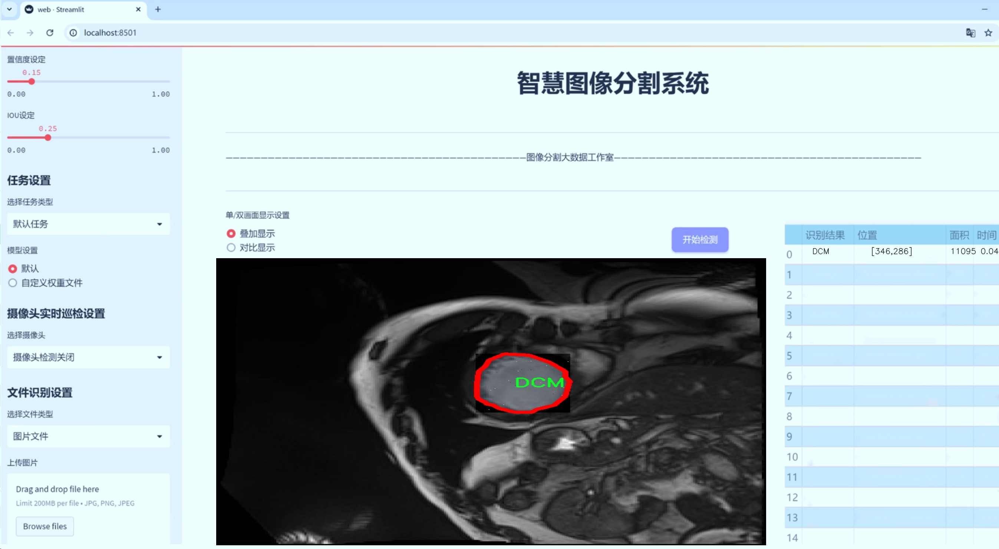
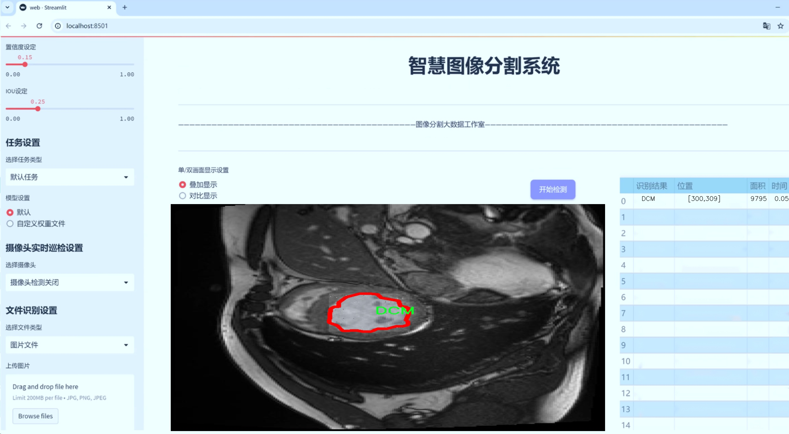
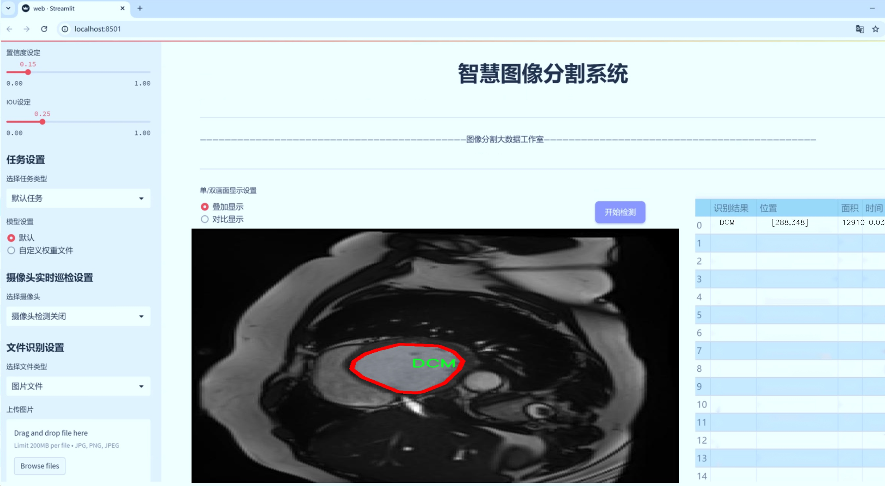
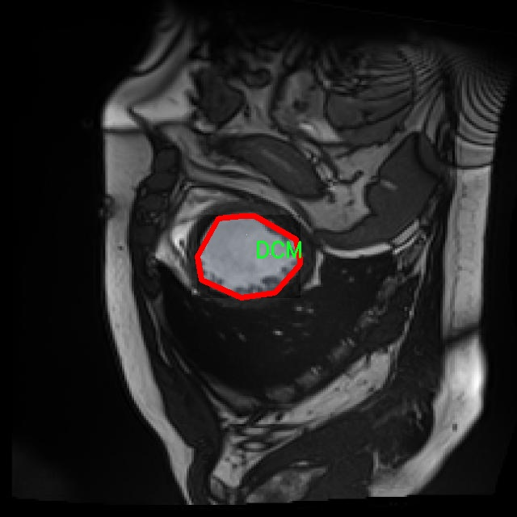
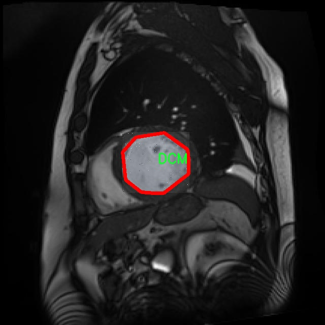
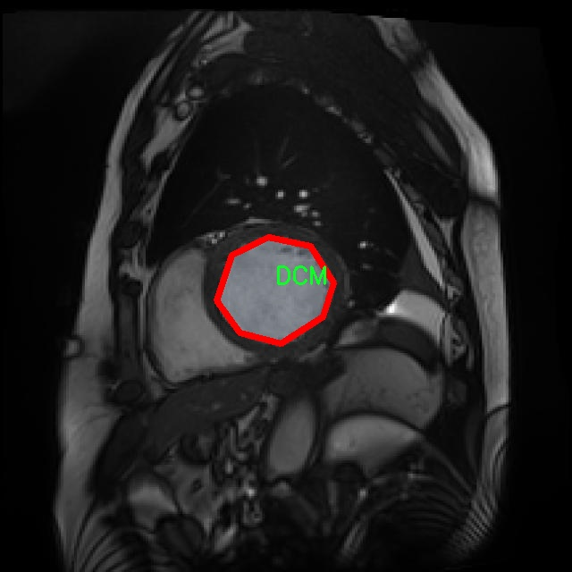
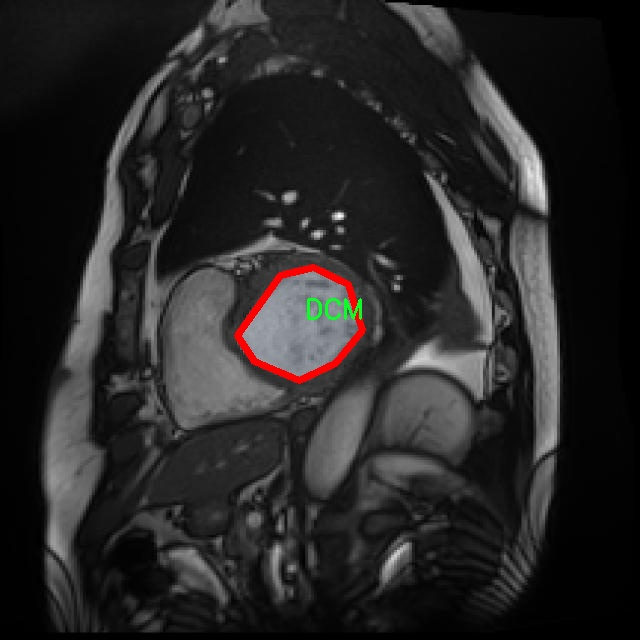
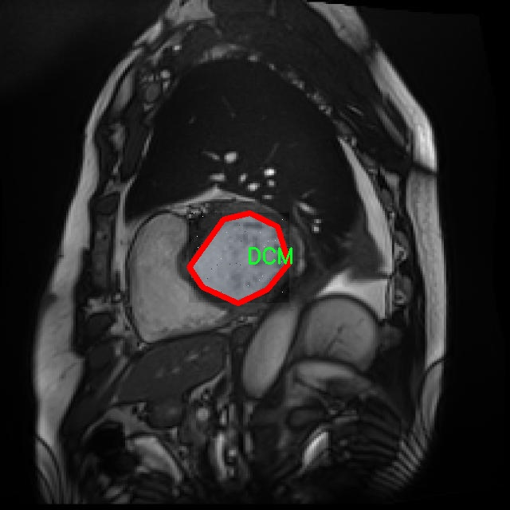

# 心脏病变图像分割系统： yolov8-seg-attention

### 1.研究背景与意义

[参考博客](https://gitee.com/YOLOv8_YOLOv11_Segmentation_Studio/projects)

[博客来源](https://kdocs.cn/l/cszuIiCKVNis)

研究背景与意义

心脏病作为全球范围内最主要的致死原因之一，其早期诊断和有效治疗显得尤为重要。随着医学影像技术的迅速发展，心脏病的影像学诊断逐渐成为临床诊断的重要手段。心脏影像的分割技术，尤其是基于深度学习的图像分割方法，已被广泛应用于心脏病的自动化诊断中。YOLO（You Only Look Once）系列模型因其高效的实时检测能力和优越的性能，成为了心脏病影像分割研究的热门选择。近年来，YOLOv8作为该系列的最新版本，进一步提升了模型的准确性和速度，适应了复杂的医学影像处理需求。

本研究旨在基于改进的YOLOv8模型，构建一个高效的心脏病变图像分割系统。我们使用的LV Segmentation ACDC DATASET V F数据集包含1200幅心脏影像，涵盖了五种不同的心脏病变类型：扩张型心肌病（DCM）、肥厚型心肌病（HCM）、心肌缺血（MINF）、正常心脏（NOR）以及右心室（RV）。这些数据的多样性和丰富性为模型的训练提供了坚实的基础，能够有效提升模型对不同类型心脏病变的识别和分割能力。

在医学影像领域，图像分割的准确性直接影响到后续的诊断和治疗方案的制定。传统的分割方法往往依赖于人工标注和经验，存在主观性强、效率低下等问题。而基于深度学习的自动化分割方法，尤其是改进的YOLOv8模型，能够通过学习大量的标注数据，自动提取特征并进行精确分割。这不仅提高了分割的准确性，也大幅度提升了临床工作的效率，为医生提供了更为可靠的决策支持。

此外，心脏病的早期诊断对于患者的预后具有重要意义。通过建立一个高效的心脏病变图像分割系统，我们可以实现对心脏病变的早期识别，帮助医生及时制定干预措施，降低心脏病的致死率。同时，该系统的推广应用也将推动心脏病影像学研究的发展，为后续的相关研究提供基础数据和技术支持。

综上所述，基于改进YOLOv8的心脏病变图像分割系统的研究，不仅具有重要的学术价值，也具备广泛的临床应用前景。通过该研究，我们期望能够为心脏病的早期诊断和治疗提供新的思路和方法，推动医学影像技术的进步，最终改善患者的健康状况和生活质量。

### 2.图片演示







注意：本项目提供完整的训练源码数据集和训练教程,由于此博客编辑较早,暂不提供权重文件（best.pt）,需要按照6.训练教程进行训练后实现上图效果。

### 3.视频演示

[3.1 视频演示](https://www.bilibili.com/video/BV1VnzqYaEFj/)

### 4.数据集信息

##### 4.1 数据集类别数＆类别名

nc: 5
names: ['DCM', 'HCM', 'MINF', 'NOR', 'RV']


##### 4.2 数据集信息简介

数据集信息展示

在心脏病变图像分割领域，准确的图像标注和分类是提高模型性能的关键。为此，本研究采用了“LV Segmentation ACDC DATASET V F”数据集，该数据集专门用于心脏病变的图像分割任务，尤其是在改进YOLOv8-seg模型的训练过程中。该数据集包含了丰富的心脏影像数据，涵盖了多种心脏病变类型，具有较高的临床应用价值和研究意义。

“LV Segmentation ACDC DATASET V F”数据集共包含五个主要类别，分别为：扩张型心肌病（DCM）、肥厚型心肌病（HCM）、心肌梗死（MINF）、正常心脏（NOR）以及右心室（RV）。这些类别不仅反映了不同类型的心脏病变，还为模型的训练提供了多样化的样本，确保了模型在实际应用中的鲁棒性和准确性。

扩张型心肌病（DCM）是心脏病变中较为常见的一种，通常表现为心室扩张和心功能减退。该类别的图像数据主要来源于临床病例，具有真实的病理特征，能够有效帮助模型学习到DCM的典型特征。肥厚型心肌病（HCM）则以心肌肥厚为特征，相关图像展示了心室壁的增厚情况，数据集中包含的HCM图像为模型提供了识别心肌肥厚的基础。心肌梗死（MINF）则是由于心脏供血不足导致的心肌坏死，其图像特征往往表现为心肌的局部缺损，数据集中的样本为模型的训练提供了重要的病理变化信息。

正常心脏（NOR）类别则作为对照组，包含了健康心脏的影像数据，帮助模型学习到正常心脏的结构特征，从而更好地区分病变与非病变状态。右心室（RV）作为心脏的重要组成部分，其影像数据同样在心脏病变的诊断中起着重要作用。数据集中包含的RV图像能够帮助模型在心脏影像分割中更全面地考虑右心室的结构变化。

数据集的多样性和丰富性为改进YOLOv8-seg模型提供了坚实的基础。在模型训练过程中，数据集的标注精确度和图像质量直接影响到模型的学习效果和最终性能。通过对这些类别的图像进行深度学习，模型能够逐步掌握不同心脏病变的特征，进而提高分割的准确性和效率。

总之，“LV Segmentation ACDC DATASET V F”数据集不仅为心脏病变图像分割提供了多样化的样本，也为后续的研究和临床应用奠定了基础。通过对该数据集的深入分析和模型训练，期望能够在心脏病变的早期诊断和治疗中发挥更大的作用，为患者的健康管理提供更为精准的支持。











### 5.项目依赖环境部署教程（零基础手把手教学）

[5.1 环境部署教程链接（零基础手把手教学）](https://www.bilibili.com/video/BV1jG4Ve4E9t/?vd_source=bc9aec86d164b67a7004b996143742dc)


[5.2 安装Python虚拟环境创建和依赖库安装视频教程链接（零基础手把手教学）](https://www.bilibili.com/video/BV1nA4VeYEze/?vd_source=bc9aec86d164b67a7004b996143742dc)

### 6.手把手YOLOV8-seg训练视频教程（零基础手把手教学）

[6.1 手把手YOLOV8-seg训练视频教程（零基础小白有手就能学会）](https://www.bilibili.com/video/BV1cA4VeYETe/?vd_source=bc9aec86d164b67a7004b996143742dc)


按照上面的训练视频教程链接加载项目提供的数据集，运行train.py即可开始训练



     Epoch   gpu_mem       box       obj       cls    labels  img_size
     1/200     0G   0.01576   0.01955  0.007536        22      1280: 100%|██████████| 849/849 [14:42<00:00,  1.04s/it]
               Class     Images     Labels          P          R     mAP@.5 mAP@.5:.95: 100%|██████████| 213/213 [01:14<00:00,  2.87it/s]
                 all       3395      17314      0.994      0.957      0.0957      0.0843

     Epoch   gpu_mem       box       obj       cls    labels  img_size
     2/200     0G   0.01578   0.01923  0.007006        22      1280: 100%|██████████| 849/849 [14:44<00:00,  1.04s/it]
               Class     Images     Labels          P          R     mAP@.5 mAP@.5:.95: 100%|██████████| 213/213 [01:12<00:00,  2.95it/s]
                 all       3395      17314      0.996      0.956      0.0957      0.0845

     Epoch   gpu_mem       box       obj       cls    labels  img_size
     3/200     0G   0.01561    0.0191  0.006895        27      1280: 100%|██████████| 849/849 [10:56<00:00,  1.29it/s]
               Class     Images     Labels          P          R     mAP@.5 mAP@.5:.95: 100%|███████   | 187/213 [00:52<00:00,  4.04it/s]
                 all       3395      17314      0.996      0.957      0.0957      0.0845


### 7.50+种全套YOLOV8-seg创新点加载调参实验视频教程（一键加载写好的改进模型的配置文件）

[7.1 50+种全套YOLOV8-seg创新点加载调参实验视频教程（一键加载写好的改进模型的配置文件）](https://www.bilibili.com/video/BV1Hw4VePEXv/?vd_source=bc9aec86d164b67a7004b996143742dc)

### YOLOV8-seg算法简介

原始YOLOV8-seg算法原理

YOLO（You Only Look Once）系列模型自2015年首次提出以来，经历了多个版本的迭代与更新，至今已发展至YOLOv8。作为该系列的最新版本，YOLOv8在推理速度、检测精度、训练和调整的便利性以及硬件支持的广泛性等方面均表现出色，成为当前计算机视觉领域中最受欢迎的目标检测算法之一。YOLOv8-seg作为YOLOv8的一个重要扩展，专注于图像分割任务，结合了目标检测与语义分割的优势，为图像理解提供了更为丰富的信息。

YOLOv8的网络结构主要由三部分组成：Backbone（骨干网络）、Neck（颈部结构）和Head（头部结构）。其中，Backbone负责特征提取，利用深度卷积网络从输入图像中提取出多层次的特征信息。YOLOv8采用了CSP（Cross Stage Partial）结构，通过将特征提取过程分为多个阶段，有效地提升了特征提取的效率和准确性。CSP结构的引入使得网络在保持较低计算量的同时，能够获得更为丰富的特征表达，从而为后续的检测和分割任务奠定了良好的基础。

在Neck部分，YOLOv8采用了PAN-FPN（Path Aggregation Network - Feature Pyramid Network）结构，旨在实现多尺度特征的融合。PAN-FPN通过对不同层次的特征进行加权融合，能够有效地提升模型对不同尺度目标的检测能力。在YOLOv8-seg中，这一特性尤为重要，因为图像分割任务通常需要对目标的边界进行精确的定位和分类，而多尺度特征的融合能够帮助模型更好地理解图像中的复杂结构。

YOLOv8的Head部分则实现了三个解耦头的设计，分别用于目标检测、边界框回归和语义分割。解耦头的引入使得每个任务可以独立优化，从而提高了模型在各个任务上的表现。在YOLOv8-seg中，语义分割头负责生成每个像素的分类结果，结合前面提取的特征信息，能够有效地实现图像的精细分割。

在模型设置方面，YOLOv8提供了多种可调参数，如depth_factor、width_factor和ratio等，允许用户根据具体需求对模型的深度、宽度和通道数进行灵活调整。这种灵活性使得YOLOv8能够适应不同的应用场景，无论是在资源受限的设备上进行实时检测，还是在高性能计算环境中进行大规模图像处理，YOLOv8均能展现出优异的性能。

YOLOv8n作为YOLOv8系列中的轻量化版本，特别适合于对计算资源要求较高的应用场景。YOLOv8n通过采用C2f模块替代传统的C3模块，进一步降低了模型的复杂度，同时保持了良好的检测性能。此外，YOLOv8n的特征融合网络中引入了BiFPN（Bidirectional Feature Pyramid Network），通过高效的双向跨尺度连接和加权特征融合，提升了模型对不同尺度特征信息的提取速度。这一设计使得YOLOv8n在处理复杂场景时，能够更快速地响应并提供准确的分割结果。

在损失函数方面，YOLOv8-seg采用了CloU（Class-aware Localization Uncertainty）损失函数，旨在提高模型对边界框回归的精度和鲁棒性。CloU损失函数通过考虑目标类别的特征，能够更好地处理目标之间的重叠和干扰，从而提升分割的准确性。这一创新使得YOLOv8-seg在面对复杂背景和相似目标时，依然能够保持较高的分割性能。

总的来说，YOLOv8-seg算法通过整合先进的网络结构、灵活的模型设置和高效的损失函数设计，提供了一种强大的图像分割解决方案。其在特征提取、特征融合和任务解耦等方面的创新，使得YOLOv8-seg不仅在目标检测任务中表现优异，更在图像分割领域展现出广阔的应用前景。随着YOLOv8-seg的不断发展与优化，未来有望在自动驾驶、医学影像分析、视频监控等多个领域发挥重要作用，推动计算机视觉技术的进一步进步。


### 9.系统功能展示（检测对象为举例，实际内容以本项目数据集为准）

图9.1.系统支持检测结果表格显示

  图9.2.系统支持置信度和IOU阈值手动调节

  图9.3.系统支持自定义加载权重文件best.pt(需要你通过步骤5中训练获得)

  图9.4.系统支持摄像头实时识别

  图9.5.系统支持图片识别

  图9.6.系统支持视频识别

  图9.7.系统支持识别结果文件自动保存

  图9.8.系统支持Excel导出检测结果数据


### 10.50+种全套YOLOV8-seg创新点原理讲解（非科班也可以轻松写刊发刊，V11版本正在科研待更新）

#### 10.1 由于篇幅限制，每个创新点的具体原理讲解就不一一展开，具体见下列网址中的创新点对应子项目的技术原理博客网址【Blog】：


[10.1 50+种全套YOLOV8-seg创新点原理讲解链接](https://gitee.com/qunmasj/good)

#### 10.2 部分改进模块原理讲解(完整的改进原理见上图和技术博客链接)【如果此小节的图加载失败可以通过CSDN或者Github搜索该博客的标题访问原始博客，原始博客图片显示正常】

### YOLOv8简介


由上图可以看出，C2中每个BottlNeck的输入Tensor的通道数channel都只是上一级的0.5倍，因此计算量明显降低。从另一方面讲，梯度流的增加，t也能够明显提升收敛速度和收敛效果。
C2i模块首先以输入tensor(n.c.h.w)经过Conv1层进行split拆分，分成两部分(n,0.5c,h,w)，一部分直接经过n个Bottlenck，另一部分经过每一操作层后都会以(n.0.5c,h,w)的尺寸进行Shortcut，最后通过Conv2层卷积输出。也就是对应n+2的Shortcut(第一层Conv1的分支tensor和split后的tensor为2+n个bottenlenneck)。
#### Neck
YOLOv8的Neck采用了PANet结构，如下图所示。

Backbone最后SPPF模块(Layer9)之后H、W经过32倍下采样，对应地Layer4经过8倍下采样，Layer6经过16倍下采样。输入图片分辨率为640*640，得到Layer4、Layer6、Layer9的分辨率分别为80*80、40*40和20*20。
Layer4、Layer6、Layer9作为PANet结构的输入，经过上采样，通道融合，最终将PANet的三个输出分支送入到Detect head中进行Loss的计算或结果解算。
与FPN(单向，自上而下)不同的是，PANet是一个双向通路网络，引入了自下向上的路径，使得底层信息更容易传递到顶层。
#### Head
Head部分相比Yolov5改动较大，直接将耦合头改为类似Yolo的解耦头结构(Decoupled-Head)，将回归分支和预测分支分离，并针对回归分支使用了Distribution Focal Loss策略中提出的积分形式表示法。之前的目标检测网络将回归坐标作为一个确定性单值进行预测，DFL将坐标转变成一个分布。


### LSKNet的架构
该博客提出的结构层级依次为：

LSK module（大核卷积序列+空间选择机制） < LSK Block （LK Selection + FFN）<LSKNet（N个LSK Block）


#### LSK 模块

LSK Block
LSKNet 是主干网络中的一个可重复堆叠的块（Block），每个LSK Block包括两个残差子块，即大核选择子块（Large Kernel Selection，LK Selection）和前馈网络子块（Feed-forward Network ，FFN），如图8。LK Selection子块根据需要动态地调整网络的感受野，FFN子块用于通道混合和特征细化，由一个全连接层、一个深度卷积、一个 GELU 激活和第二个全连接层组成。

LSK module（LSK 模块，图4）由一个大核卷积序列（large kernel convolutions）和一个空间核选择机制（spatial kernel selection mechanism）组成，被嵌入到了LSK Block 的 LK Selection子块中。

#### Large Kernel Convolutions
因为不同类型的目标对背景信息的需求不同，这就需要模型能够自适应选择不同大小的背景范围。因此，作者通过解耦出一系列具有大卷积核、且不断扩张的Depth-wise 卷积，构建了一个更大感受野的网络。

具体地，假设序列中第i个Depth-wise 卷积核的大小为 ，扩张率为 d，感受野为 ，它们满足以下关系：


卷积核大小和扩张率的增加保证了感受野能够快速增大。此外，我们设置了扩张率的上限，以保证扩张卷积不会引入特征图之间的差距。


Table2的卷积核大小可根据公式（1）和（2）计算，详见下图：


这样设计的好处有两点。首先，能够产生具有多种不同大小感受野的特征，便于后续的核选择；第二，序列解耦比简单的使用一个大型卷积核效果更好。如上图表2所示，解耦操作相对于标准的大型卷积核，有效地将低了模型的参数量。

为了从输入数据  的不同区域获取丰富的背景信息特征，可采用一系列解耦的、不用感受野的Depth-wise 卷积核：


其中，是卷积核为 、扩张率为  的Depth-wise 卷积操作。假设有个解耦的卷积核，每个卷积操作后又要经过一个的卷积层进行空间特征向量的通道融合。


之后，针对不同的目标，可基于获取的多尺度特征，通过下文中的选择机制动态选择合适的卷积核大小。

这一段的意思可以简单理解为：

把一个大的卷积核拆成了几个小的卷积核，比如一个大小为5，扩张率为1的卷积核加上一个大小为7，扩张率为3的卷积核，感受野为23，与一个大小为23，扩张率为1的卷积核的感受野是一样的。因此可用两个小的卷积核替代一个大的卷积核，同理一个大小为29的卷积核也可以用三个小的卷积代替（Table 2），这样可以有效的减少参数，且更灵活。

将输入数据依次通过这些小的卷积核（公式3），并在每个小的卷积核后面接上一个1×1的卷积进行通道融合（公式4）。

#### Spatial Kernel Selection
为了使模型更关注目标在空间上的重点背景信息，作者使用空间选择机制从不同尺度的大卷积核中对特征图进行空间选择。

首先，将来自于不同感受野卷积核的特征进行concate拼接，然后，应用通道级的平均池化和最大池化提取空间关系，其中， 和  是平均池化和最大池化后的空间特征描述符。为了实现不同空间描述符的信息交互，作者利用卷积层将空间池化特征进行拼接，将2个通道的池化特征转换为N个空间注意力特征图，之后，将Sigmoid激活函数应用到每一个空间注意力特征图，可获得每个解耦的大卷积核所对应的独立的空间选择掩膜，又然后，将解耦后的大卷积核序列的特征与对应的空间选择掩膜进行加权处理，并通过卷积层进行融合获得注意力特征 ，最后LSK module的输出可通过输入特征  与注意力特征  的逐元素点成获得，公式对应于结构图上的操作如下：


### 11.项目核心源码讲解（再也不用担心看不懂代码逻辑）

#### 11.1 ultralytics\models\yolo\detect\train.py

以下是对给定代码的核心部分进行分析和详细注释的结果：

```python
# Ultralytics YOLO 🚀, AGPL-3.0 license

from copy import copy
import numpy as np
from ultralytics.data import build_dataloader, build_yolo_dataset
from ultralytics.engine.trainer import BaseTrainer
from ultralytics.models import yolo
from ultralytics.nn.tasks import DetectionModel
from ultralytics.utils import LOGGER, RANK
from ultralytics.utils.plotting import plot_images, plot_labels, plot_results
from ultralytics.utils.torch_utils import de_parallel, torch_distributed_zero_first

class DetectionTrainer(BaseTrainer):
    """
    扩展自 BaseTrainer 类的检测模型训练类。
    用于训练 YOLO 检测模型。
    """

    def build_dataset(self, img_path, mode='train', batch=None):
        """
        构建 YOLO 数据集。

        参数:
            img_path (str): 包含图像的文件夹路径。
            mode (str): 模式，'train' 或 'val'，用户可以为每种模式自定义不同的增强。
            batch (int, optional): 批次大小，仅适用于 'rect' 模式。默认为 None。
        """
        # 获取模型的最大步幅，并确保至少为 32
        gs = max(int(de_parallel(self.model).stride.max() if self.model else 0), 32)
        # 构建并返回 YOLO 数据集
        return build_yolo_dataset(self.args, img_path, batch, self.data, mode=mode, rect=mode == 'val', stride=gs)

    def get_dataloader(self, dataset_path, batch_size=16, rank=0, mode='train'):
        """构造并返回数据加载器。"""
        assert mode in ['train', 'val']  # 确保模式有效
        with torch_distributed_zero_first(rank):  # 在分布式训练中，仅初始化一次数据集
            dataset = self.build_dataset(dataset_path, mode, batch_size)  # 构建数据集
        shuffle = mode == 'train'  # 训练模式下打乱数据
        if getattr(dataset, 'rect', False) and shuffle:
            LOGGER.warning("WARNING ⚠️ 'rect=True' 与 DataLoader 的 shuffle 不兼容，设置 shuffle=False")
            shuffle = False
        workers = self.args.workers if mode == 'train' else self.args.workers * 2  # 设置工作线程数
        return build_dataloader(dataset, batch_size, workers, shuffle, rank)  # 返回数据加载器

    def preprocess_batch(self, batch):
        """对图像批次进行预处理，缩放并转换为浮点数。"""
        batch['img'] = batch['img'].to(self.device, non_blocking=True).float() / 255  # 将图像转换为浮点数并归一化
        return batch

    def set_model_attributes(self):
        """设置模型的属性，包括类别数量和名称。"""
        self.model.nc = self.data['nc']  # 将类别数量附加到模型
        self.model.names = self.data['names']  # 将类别名称附加到模型
        self.model.args = self.args  # 将超参数附加到模型

    def get_model(self, cfg=None, weights=None, verbose=True):
        """返回 YOLO 检测模型。"""
        model = DetectionModel(cfg, nc=self.data['nc'], verbose=verbose and RANK == -1)  # 创建检测模型
        if weights:
            model.load(weights)  # 加载权重
        return model

    def get_validator(self):
        """返回用于 YOLO 模型验证的 DetectionValidator。"""
        self.loss_names = 'box_loss', 'cls_loss', 'dfl_loss'  # 定义损失名称
        return yolo.detect.DetectionValidator(self.test_loader, save_dir=self.save_dir, args=copy(self.args))  # 返回验证器

    def plot_training_samples(self, batch, ni):
        """绘制带有注释的训练样本。"""
        plot_images(images=batch['img'],
                    batch_idx=batch['batch_idx'],
                    cls=batch['cls'].squeeze(-1),
                    bboxes=batch['bboxes'],
                    paths=batch['im_file'],
                    fname=self.save_dir / f'train_batch{ni}.jpg',
                    on_plot=self.on_plot)  # 保存训练样本图像

    def plot_metrics(self):
        """绘制来自 CSV 文件的指标。"""
        plot_results(file=self.csv, on_plot=self.on_plot)  # 保存结果图像
```

### 核心部分分析
1. **类定义**：`DetectionTrainer` 类是一个专门用于训练 YOLO 检测模型的类，继承自 `BaseTrainer`。
2. **数据集构建**：`build_dataset` 方法负责根据给定的图像路径和模式构建 YOLO 数据集。
3. **数据加载器**：`get_dataloader` 方法创建数据加载器，支持分布式训练，并根据模式决定是否打乱数据。
4. **预处理**：`preprocess_batch` 方法对图像批次进行归一化处理。
5. **模型设置**：`set_model_attributes` 方法将类别数量和名称等属性设置到模型中。
6. **模型获取**：`get_model` 方法返回一个 YOLO 检测模型实例，并可选择加载预训练权重。
7. **验证器**：`get_validator` 方法返回一个用于模型验证的对象。
8. **绘图功能**：`plot_training_samples` 和 `plot_metrics` 方法用于可视化训练样本和训练指标。

这些核心部分共同构成了 YOLO 模型训练的基础框架，提供了数据处理、模型管理和结果可视化的功能。

该文件是Ultralytics YOLO模型的训练模块，主要用于构建和训练基于YOLO的目标检测模型。文件中定义了一个名为`DetectionTrainer`的类，该类继承自`BaseTrainer`，并实现了一系列与目标检测相关的功能。

在`DetectionTrainer`类中，首先定义了`build_dataset`方法，该方法用于构建YOLO数据集。它接收图像路径、模式（训练或验证）和批次大小作为参数，并根据模型的步幅设置生成数据集。这里使用了`build_yolo_dataset`函数来实际构建数据集。

接着，`get_dataloader`方法用于创建数据加载器。它会根据传入的模式（训练或验证）构建相应的数据集，并设置是否打乱数据的顺序。对于训练模式，数据会被打乱，而在验证模式下，通常不需要打乱。该方法还考虑了分布式训练的情况，确保数据集的初始化只发生一次。

`preprocess_batch`方法负责对每个批次的图像进行预处理，包括将图像转换为浮点数并归一化到[0, 1]的范围。

`set_model_attributes`方法用于设置模型的属性，包括类别数量和类别名称等。这样可以确保模型在训练时使用正确的超参数。

`get_model`方法返回一个YOLO检测模型的实例，支持加载预训练权重。`get_validator`方法则返回一个用于模型验证的`DetectionValidator`实例，帮助评估模型的性能。

在损失计算方面，`label_loss_items`方法返回一个包含训练损失项的字典，这对于目标检测任务是必要的。`progress_string`方法用于格式化输出训练进度的信息，包括当前的epoch、GPU内存使用情况和损失值等。

此外，`plot_training_samples`方法用于绘制训练样本及其标注，便于可视化训练过程中的数据。`plot_metrics`和`plot_training_labels`方法则用于绘制训练过程中的各种指标和标签，以便于分析模型的性能。

总的来说，这个文件实现了YOLO模型训练的核心功能，包括数据集构建、数据加载、模型设置、损失计算和可视化等，为用户提供了一个完整的训练框架。

#### 11.2 ultralytics\utils\callbacks\hub.py

以下是经过简化并添加详细中文注释的核心代码部分：

```python
import json
from time import time
from ultralytics.hub.utils import HUB_WEB_ROOT, PREFIX, events
from ultralytics.utils import LOGGER, SETTINGS

def on_fit_epoch_end(trainer):
    """在每个训练周期结束时上传训练进度指标。"""
    session = getattr(trainer, 'hub_session', None)  # 获取训练器的会话对象
    if session:
        # 收集训练损失和其他指标
        all_plots = {**trainer.label_loss_items(trainer.tloss, prefix='train'), **trainer.metrics}
        if trainer.epoch == 0:
            from ultralytics.utils.torch_utils import model_info_for_loggers
            # 在第一个周期时，添加模型信息
            all_plots = {**all_plots, **model_info_for_loggers(trainer)}
        
        # 将当前周期的指标数据添加到会话的指标队列中
        session.metrics_queue[trainer.epoch] = json.dumps(all_plots)
        
        # 检查是否超过上传速率限制
        if time() - session.timers['metrics'] > session.rate_limits['metrics']:
            session.upload_metrics()  # 上传指标
            session.timers['metrics'] = time()  # 重置计时器
            session.metrics_queue = {}  # 重置指标队列

def on_model_save(trainer):
    """以速率限制的方式将检查点保存到Ultralytics HUB。"""
    session = getattr(trainer, 'hub_session', None)  # 获取训练器的会话对象
    if session:
        is_best = trainer.best_fitness == trainer.fitness  # 判断当前模型是否是最佳模型
        # 检查是否超过上传速率限制
        if time() - session.timers['ckpt'] > session.rate_limits['ckpt']:
            LOGGER.info(f'{PREFIX}Uploading checkpoint {HUB_WEB_ROOT}/models/{session.model_id}')  # 日志记录上传信息
            session.upload_model(trainer.epoch, trainer.last, is_best)  # 上传模型
            session.timers['ckpt'] = time()  # 重置计时器

def on_train_end(trainer):
    """在训练结束时将最终模型和指标上传到Ultralytics HUB。"""
    session = getattr(trainer, 'hub_session', None)  # 获取训练器的会话对象
    if session:
        LOGGER.info(f'{PREFIX}Syncing final model...')  # 日志记录同步信息
        # 上传最终模型和指标
        session.upload_model(trainer.epoch, trainer.best, map=trainer.metrics.get('metrics/mAP50-95(B)', 0), final=True)
        session.alive = False  # 停止心跳
        LOGGER.info(f'{PREFIX}Done ✅\n'
                    f'{PREFIX}View model at {HUB_WEB_ROOT}/models/{session.model_id} 🚀')  # 日志记录完成信息

# 根据设置决定是否启用回调函数
callbacks = {
    'on_fit_epoch_end': on_fit_epoch_end,
    'on_model_save': on_model_save,
    'on_train_end': on_train_end
} if SETTINGS['hub'] is True else {}  # 验证是否启用
```

### 代码说明：
1. **on_fit_epoch_end**: 该函数在每个训练周期结束时被调用，负责收集并上传训练进度指标。它会检查是否超过了上传速率限制，并在合适的时机上传指标数据。

2. **on_model_save**: 该函数负责在训练过程中保存模型检查点。它会判断当前模型是否是最佳模型，并在满足速率限制的情况下上传模型。

3. **on_train_end**: 该函数在训练结束时被调用，负责上传最终的模型和训练指标，并停止会话的心跳。

4. **callbacks**: 这是一个字典，存储了不同事件对应的回调函数，根据设置决定是否启用这些回调。

这个程序文件是一个用于Ultralytics YOLO模型训练的回调函数模块，主要负责在训练、验证和导出过程中处理与Ultralytics HUB的交互。文件中定义了一系列的回调函数，这些函数在特定的训练阶段被调用，以便上传模型和训练进度的相关信息。

首先，文件导入了一些必要的库和模块，包括`json`和`time`，以及Ultralytics HUB的相关工具和日志记录器。接下来，定义了一些回调函数：

- `on_pretrain_routine_end(trainer)`：在预训练例程结束时调用，主要用于记录信息并启动上传速率限制的计时器。如果存在hub会话，它会记录模型的访问链接，并初始化计时器。

- `on_fit_epoch_end(trainer)`：在每个训练周期结束时调用，负责上传训练进度的指标。如果是第一个周期，还会添加模型信息。它会检查是否超过了上传速率限制，如果是，则上传指标并重置计时器和指标队列。

- `on_model_save(trainer)`：在模型保存时调用，负责将检查点上传到Ultralytics HUB，并考虑上传速率限制。如果当前模型是最佳模型，则会标记为最佳并上传。

- `on_train_end(trainer)`：在训练结束时调用，上传最终模型和指标到Ultralytics HUB，并停止心跳信号，表示训练完成。

- `on_train_start(trainer)`、`on_val_start(validator)`、`on_predict_start(predictor)`和`on_export_start(exporter)`：这些函数在训练、验证、预测和导出开始时调用，主要用于执行与这些事件相关的操作。

最后，文件定义了一个`callbacks`字典，将上述回调函数与其对应的事件名称关联起来。这个字典只有在`SETTINGS['hub']`为`True`时才会被创建，确保只有在启用HUB功能时才会使用这些回调。

总体而言，这个模块通过回调机制实现了与Ultralytics HUB的有效交互，确保在训练过程中能够实时上传模型和训练进度，便于后续的模型管理和监控。

#### 11.3 ultralytics\engine\__init__.py

以下是对代码的核心部分进行提炼和详细注释的结果：

```python
# Ultralytics YOLO 🚀, AGPL-3.0 license

# 导入必要的库
import torch  # 导入PyTorch库，用于深度学习
from models.experimental import attempt_load  # 从模型模块导入尝试加载模型的函数
from utils.datasets import LoadImages  # 从数据集模块导入加载图像的类
from utils.general import check_img_size, non_max_suppression  # 导入图像尺寸检查和非极大值抑制函数
from utils.torch_utils import select_device  # 导入选择设备的函数

# 选择计算设备（CPU或GPU）
device = select_device('')  # 选择默认设备，空字符串表示自动选择

# 加载YOLO模型
model = attempt_load('yolov5s.pt', map_location=device)  # 加载预训练的YOLOv5s模型

# 检查输入图像的尺寸
img_size = check_img_size(640, s=model.stride.max())  # 检查640是否为合适的输入尺寸

# 加载图像数据
dataset = LoadImages('data/images', img_size=img_size)  # 从指定路径加载图像，调整为合适的尺寸

# 遍历数据集中的每一张图像
for path, img, im0s, vid_cap in dataset:
    img = torch.from_numpy(img).to(device).float() / 255.0  # 将图像转换为Tensor并归一化
    img = img.unsqueeze(0)  # 增加一个维度以匹配模型输入

    # 进行推理
    pred = model(img, augment=False)[0]  # 获取模型的预测结果

    # 应用非极大值抑制以去除冗余的检测框
    pred = non_max_suppression(pred, conf_thres=0.25, iou_thres=0.45)  # 设置置信度和IOU阈值

    # 处理每个检测结果
    for det in pred:  # 遍历每个检测结果
        if len(det):  # 如果检测到物体
            # 进行后续处理，如绘制框、输出结果等
            pass  # 这里可以添加处理代码
```

### 代码注释说明：
1. **导入库**：导入必要的库和模块以支持模型加载、数据处理和设备选择。
2. **选择设备**：通过`select_device`函数选择使用的计算设备（CPU或GPU）。
3. **加载模型**：使用`attempt_load`函数加载预训练的YOLOv5模型。
4. **检查图像尺寸**：确保输入图像的尺寸符合模型要求。
5. **加载图像数据**：使用`LoadImages`类从指定路径加载图像，并调整为合适的尺寸。
6. **图像处理循环**：遍历数据集中每一张图像，进行必要的预处理（如归一化和维度调整）。
7. **模型推理**：将处理后的图像输入模型，获取预测结果。
8. **非极大值抑制**：通过`non_max_suppression`函数去除冗余的检测框，以提高检测结果的准确性。
9. **结果处理**：对每个检测结果进行处理，可以添加绘制框和输出结果的代码。

以上是对YOLO模型推理过程的核心代码及其详细注释。

该文件是Ultralytics YOLO项目的一部分，YOLO是一种流行的目标检测算法。文件的开头包含了版权信息，表明该项目遵循AGPL-3.0许可证，这意味着用户可以自由使用、修改和分发该软件，但必须在相同的许可证下发布衍生作品。

在这个文件中，通常会包含与YOLO模型相关的初始化代码，可能涉及模型的加载、配置以及其他必要的设置。通过这个`__init__.py`文件，Python可以将该目录视为一个包，从而允许用户导入该包中的模块和功能。

在Ultralytics YOLO项目中，`__init__.py`文件的作用是确保包的结构和可用性，方便用户在使用YOLO进行目标检测时，能够轻松地访问所需的功能和类。这个文件可能还会引入其他模块，定义一些常量或配置参数，帮助用户快速上手和使用YOLO模型进行训练和推理。

总的来说，这个文件是Ultralytics YOLO框架的重要组成部分，确保了包的正常运行和模块的可访问性。

#### 11.4 ultralytics\nn\extra_modules\block.py

以下是保留的核心代码部分，并附上详细的中文注释：

```python
import torch
import torch.nn as nn
import torch.nn.functional as F

class Conv(nn.Module):
    """定义一个卷积层，包含卷积、批归一化和激活函数"""
    def __init__(self, in_channels, out_channels, kernel_size=3, stride=1, padding=None, groups=1, act=True):
        super().__init__()
        if padding is None:
            padding = kernel_size // 2  # 默认填充为卷积核大小的一半
        self.conv = nn.Conv2d(in_channels, out_channels, kernel_size, stride, padding, groups=groups, bias=False)
        self.bn = nn.BatchNorm2d(out_channels)  # 批归一化
        self.act = nn.ReLU() if act else nn.Identity()  # 激活函数，默认为ReLU

    def forward(self, x):
        """前向传播"""
        return self.act(self.bn(self.conv(x)))  # 先卷积，再批归一化，最后激活

class Bottleneck(nn.Module):
    """标准的瓶颈结构"""
    def __init__(self, c1, c2, shortcut=True, g=1, k=(3, 3), e=0.5):
        super().__init__()
        c_ = int(c2 * e)  # 隐藏通道数
        self.cv1 = Conv(c1, c_, k[0], 1)  # 第一个卷积层
        self.cv2 = Conv(c_, c2, k[1], 1, g=g)  # 第二个卷积层
        self.add = shortcut and c1 == c2  # 是否使用快捷连接

    def forward(self, x):
        """前向传播"""
        return x + self.cv2(self.cv1(x)) if self.add else self.cv2(self.cv1(x))  # 如果使用快捷连接，则加上输入x

class C3(nn.Module):
    """C3模块，包含多个瓶颈结构"""
    def __init__(self, c1, c2, n=1, shortcut=False, g=1, e=0.5):
        super().__init__()
        self.m = nn.Sequential(*(Bottleneck(c1, c2, shortcut, g, k=(3, 3), e=e) for _ in range(n)))  # n个瓶颈结构

    def forward(self, x):
        """前向传播"""
        return self.m(x)  # 直接通过nn.Sequential执行

class DyHeadBlock(nn.Module):
    """动态头部块，包含多种注意力机制"""
    def __init__(self, in_channels, norm_type='GN', zero_init_offset=True):
        super().__init__()
        self.spatial_conv_offset = nn.Conv2d(in_channels, 3 * 3 * 3, 3, padding=1)  # 计算偏移量和掩码
        self.spatial_conv_mid = Conv(in_channels, in_channels)  # 中间卷积
        self.scale_attn_module = nn.Sequential(
            nn.AdaptiveAvgPool2d(1), 
            nn.Conv2d(in_channels, 1, 1), 
            nn.ReLU(inplace=True)
        )  # 规模注意力模块
        self.task_attn_module = nn.Sequential(Conv(in_channels, in_channels), nn.ReLU())  # 任务注意力模块

    def forward(self, x):
        """前向传播"""
        offset_and_mask = self.spatial_conv_offset(x)  # 计算偏移量和掩码
        mid_feat = self.spatial_conv_mid(x)  # 中间特征
        scale_attn = self.scale_attn_module(mid_feat)  # 规模注意力
        return self.task_attn_module(mid_feat * scale_attn)  # 返回加权后的特征

class Fusion(nn.Module):
    """融合模块，用于不同特征图的融合"""
    def __init__(self, inc_list):
        super().__init__()
        self.fusion_conv = nn.ModuleList([Conv(inc, inc, 1) for inc in inc_list])  # 对每个输入通道进行1x1卷积

    def forward(self, x):
        """前向传播"""
        for i in range(len(x)):
            x[i] = self.fusion_conv[i](x[i])  # 对每个输入特征图进行卷积
        return torch.cat(x, dim=1)  # 在通道维度上拼接

# 其他模块和类的定义省略
```

### 代码说明
1. **Conv类**：定义了一个卷积层，包含卷积、批归一化和激活函数。
2. **Bottleneck类**：实现了标准的瓶颈结构，包含两个卷积层和一个可选的快捷连接。
3. **C3类**：包含多个瓶颈结构的模块。
4. **DyHeadBlock类**：实现了动态头部块，包含偏移量计算和多种注意力机制。
5. **Fusion类**：用于融合不同特征图的模块。

这些核心部分是实现神经网络的重要组成部分，包含了卷积、注意力机制和特征融合等关键技术。

这个程序文件 `ultralytics\nn\extra_modules\block.py` 是一个深度学习模型的实现，主要用于构建各种神经网络模块，特别是在计算机视觉任务中。该文件包含多个类和函数，以下是对其主要内容的说明。

首先，文件导入了一些必要的库，包括 PyTorch 和其他自定义模块。然后定义了一些通用的工具函数，比如 `autopad` 用于自动计算卷积的填充，以确保输出的形状与输入一致。

接下来，文件中定义了多个神经网络模块的类。比如 `DyHeadBlock` 和 `DyHeadBlockWithDCNV3` 是实现动态头部的模块，使用了不同的卷积和注意力机制来增强特征提取能力。`Fusion` 类实现了不同特征图的融合策略，包括加权、适应性融合等。

在 `C2f` 和 `C3` 等类中，定义了多种结构的卷积块，利用残差连接和不同的卷积方式（如深度可分离卷积、普通卷积等）来构建更深的网络。这些模块通常用于构建更复杂的网络架构，如 YOLO 等目标检测模型。

此外，文件中还实现了一些特殊的卷积层，如 `RFAConv`、`DCNv2` 和 `DCNv3`，这些都是针对特定任务优化的卷积操作，旨在提高模型的性能和效率。

`Bottleneck` 类及其子类实现了瓶颈结构，这是一种常见的网络设计模式，通过减少特征图的维度来降低计算复杂度，同时保留重要的特征信息。

文件的最后部分实现了一些新的模块，如 `ContextGuidedBlock` 和 `MSBlock`，这些模块通过引入上下文信息和多尺度特征来增强网络的表达能力。

总的来说，这个文件实现了一个灵活且功能强大的模块化设计，允许用户根据具体任务的需求来组合和调整不同的网络层和结构，适用于多种计算机视觉任务。

#### 11.5 ultralytics\nn\extra_modules\rep_block.py

以下是经过简化并添加详细中文注释的核心代码部分：

```python
import torch
import torch.nn as nn
import torch.nn.functional as F

# 定义一个用于融合卷积核和批归一化层的函数
def transI_fusebn(kernel, bn):
    # 获取批归一化的参数
    gamma = bn.weight
    std = (bn.running_var + bn.eps).sqrt()  # 计算标准差
    # 返回融合后的卷积核和偏置
    return kernel * ((gamma / std).reshape(-1, 1, 1, 1)), bn.bias - bn.running_mean * gamma / std

# 定义一个用于将多个卷积核和偏置相加的函数
def transII_addbranch(kernels, biases):
    return sum(kernels), sum(biases)

# 定义一个用于处理1x1卷积和kxk卷积的函数
def transIII_1x1_kxk(k1, b1, k2, b2, groups):
    if groups == 1:
        # 对于单组卷积，直接进行卷积操作
        k = F.conv2d(k2, k1.permute(1, 0, 2, 3))
        b_hat = (k2 * b1.reshape(1, -1, 1, 1)).sum((1, 2, 3))
    else:
        # 对于多组卷积，逐组进行卷积操作
        k_slices = []
        b_slices = []
        k1_T = k1.permute(1, 0, 2, 3)
        k1_group_width = k1.size(0) // groups
        k2_group_width = k2.size(0) // groups
        for g in range(groups):
            k1_T_slice = k1_T[:, g*k1_group_width:(g+1)*k1_group_width, :, :]
            k2_slice = k2[g*k2_group_width:(g+1)*k2_group_width, :, :, :]
            k_slices.append(F.conv2d(k2_slice, k1_T_slice))
            b_slices.append((k2_slice * b1[g*k1_group_width:(g+1)*k1_group_width].reshape(1, -1, 1, 1)).sum((1, 2, 3)))
        k, b_hat = transIV_depthconcat(k_slices, b_slices)
    return k, b_hat + b2

# 定义一个用于将多个卷积核和偏置在深度维度上拼接的函数
def transIV_depthconcat(kernels, biases):
    return torch.cat(kernels, dim=0), torch.cat(biases)

# 定义一个用于平均池化的卷积核生成函数
def transV_avg(channels, kernel_size, groups):
    input_dim = channels // groups
    k = torch.zeros((channels, input_dim, kernel_size, kernel_size))
    k[np.arange(channels), np.tile(np.arange(input_dim), groups), :, :] = 1.0 / kernel_size ** 2
    return k

# 定义一个卷积层和批归一化层的组合
def conv_bn(in_channels, out_channels, kernel_size, stride=1, padding=0, dilation=1, groups=1):
    conv_layer = nn.Conv2d(in_channels=in_channels, out_channels=out_channels, kernel_size=kernel_size,
                           stride=stride, padding=padding, dilation=dilation, groups=groups,
                           bias=False)
    bn_layer = nn.BatchNorm2d(num_features=out_channels, affine=True)
    return nn.Sequential(conv_layer, bn_layer)

# 定义一个多分支块的类
class DiverseBranchBlock(nn.Module):
    def __init__(self, in_channels, out_channels, kernel_size, stride=1, padding=None, dilation=1, groups=1):
        super(DiverseBranchBlock, self).__init__()
        
        # 设置卷积块的参数
        self.kernel_size = kernel_size
        self.out_channels = out_channels
        self.groups = groups
        
        # 自动计算填充
        if padding is None:
            padding = kernel_size // 2
        
        # 定义原始卷积和批归一化层
        self.dbb_origin = conv_bn(in_channels=in_channels, out_channels=out_channels, kernel_size=kernel_size, stride=stride, padding=padding, dilation=dilation, groups=groups)

    def forward(self, inputs):
        # 前向传播
        out = self.dbb_origin(inputs)  # 通过原始卷积块
        return out  # 返回输出
```

### 代码说明：
1. **transI_fusebn**: 该函数用于将卷积核和批归一化层的参数融合，返回融合后的卷积核和偏置。
2. **transII_addbranch**: 该函数用于将多个卷积核和偏置相加，返回合并后的结果。
3. **transIII_1x1_kxk**: 该函数处理1x1卷积和kxk卷积的组合，支持多组卷积。
4. **transIV_depthconcat**: 该函数用于在深度维度上拼接多个卷积核和偏置。
5. **transV_avg**: 该函数生成用于平均池化的卷积核。
6. **conv_bn**: 该函数定义了一个组合层，包括卷积层和批归一化层。
7. **DiverseBranchBlock**: 这是一个多分支卷积块的类，包含多个卷积路径，适用于复杂的网络结构。

这个程序文件定义了一个名为 `DiverseBranchBlock` 的神经网络模块，主要用于构建深度学习模型中的多分支卷积结构。文件中使用了 PyTorch 框架，包含了一些用于卷积和批归一化的辅助函数，以及一个自定义的卷积层和一个批归一化层。

首先，文件导入了必要的库，包括 `torch` 和 `torch.nn`，并定义了一些函数来处理卷积和批归一化的转换。这些函数的主要功能包括将卷积核和批归一化参数融合、对卷积结果进行加法操作、处理不同尺寸的卷积核等。

`conv_bn` 函数用于创建一个包含卷积层和批归一化层的序列。该函数接受输入通道数、输出通道数、卷积核大小等参数，并返回一个包含卷积和批归一化的模块。

`IdentityBasedConv1x1` 类是一个自定义的卷积层，主要用于实现带有恒等映射的 1x1 卷积。它在初始化时创建了一个恒等映射的张量，并在前向传播中将其与卷积权重相加，以实现恒等映射的效果。

`BNAndPadLayer` 类是一个包含批归一化和填充操作的模块。它在前向传播中首先对输入进行批归一化，然后根据需要进行填充，确保输出的尺寸与输入一致。

`DiverseBranchBlock` 类是文件的核心部分，构造函数中接受多个参数来初始化不同的卷积和批归一化层。根据输入的参数，模块可以选择不同的结构，例如使用平均池化层、1x1 卷积层等。该模块的设计旨在提高模型的表达能力和灵活性。

`get_equivalent_kernel_bias` 方法用于获取当前模块的等效卷积核和偏置。它通过调用之前定义的转换函数，将不同分支的卷积核和偏置合并为一个等效的卷积层。

`switch_to_deploy` 方法用于将模块切换到部署模式。在这个模式下，模块会将所有的分支合并为一个单一的卷积层，以减少计算量和内存占用。

`forward` 方法定义了模块的前向传播逻辑，计算输入的输出。根据模块的状态，它会选择使用重参数化的卷积层或原始的分支结构进行计算。

最后，模块还提供了一些初始化方法，例如 `init_gamma` 和 `single_init`，用于初始化批归一化层的权重，以便在训练过程中更好地收敛。

总体来说，这个文件实现了一个灵活且高效的多分支卷积模块，适用于各种深度学习任务，尤其是在需要高效特征提取的场景中。

### 12.系统整体结构（节选）

### 整体功能和构架概括

Ultralytics YOLO项目是一个用于目标检测的深度学习框架，提供了训练、验证和推理等功能。该框架采用模块化设计，允许用户灵活地构建和训练YOLO模型。项目的核心包括模型定义、训练流程、数据处理和回调机制等。通过这些模块，用户可以方便地进行模型训练、评估和部署。

- **模型训练**：通过 `train.py` 文件实现，负责数据集构建、模型训练、损失计算和可视化等功能。
- **回调机制**：通过 `hub.py` 文件实现，负责与Ultralytics HUB的交互，上传训练进度和模型信息。
- **模块初始化**：通过 `__init__.py` 文件实现，确保包的结构和可用性，方便用户导入和使用。
- **网络模块**：通过 `block.py` 和 `rep_block.py` 文件实现，定义了多种神经网络层和结构，支持复杂的模型设计。

### 文件功能整理表

| 文件路径                                         | 功能描述                                                                                   |
|--------------------------------------------------|--------------------------------------------------------------------------------------------|
| `ultralytics/models/yolo/detect/train.py`       | 实现YOLO模型的训练流程，包括数据集构建、数据加载、模型设置、损失计算和可视化等功能。    |
| `ultralytics/utils/callbacks/hub.py`           | 实现与Ultralytics HUB的回调机制，负责上传训练进度和模型信息，便于模型管理和监控。       |
| `ultralytics/engine/__init__.py`                | 确保Ultralytics YOLO包的结构和可用性，允许用户导入和使用该包中的模块和功能。             |
| `ultralytics/nn/extra_modules/block.py`         | 定义多种神经网络模块，包括卷积层、批归一化层和多分支结构，支持复杂的网络架构设计。      |
| `ultralytics/nn/extra_modules/rep_block.py`     | 实现多分支卷积模块，支持重参数化卷积，增强模型的表达能力和灵活性。                     |

这个表格概述了每个文件的主要功能，帮助用户理解Ultralytics YOLO项目的结构和模块之间的关系。

### 13.图片、视频、摄像头图像分割Demo(去除WebUI)代码

在这个博客小节中，我们将讨论如何在不使用WebUI的情况下，实现图像分割模型的使用。本项目代码已经优化整合，方便用户将分割功能嵌入自己的项目中。
核心功能包括图片、视频、摄像头图像的分割，ROI区域的轮廓提取、类别分类、周长计算、面积计算、圆度计算以及颜色提取等。
这些功能提供了良好的二次开发基础。

### 核心代码解读

以下是主要代码片段，我们会为每一块代码进行详细的批注解释：

```python
import random
import cv2
import numpy as np
from PIL import ImageFont, ImageDraw, Image
from hashlib import md5
from model import Web_Detector
from chinese_name_list import Label_list

# 根据名称生成颜色
def generate_color_based_on_name(name):
    ......

# 计算多边形面积
def calculate_polygon_area(points):
    return cv2.contourArea(points.astype(np.float32))

...
# 绘制中文标签
def draw_with_chinese(image, text, position, font_size=20, color=(255, 0, 0)):
    image_pil = Image.fromarray(cv2.cvtColor(image, cv2.COLOR_BGR2RGB))
    draw = ImageDraw.Draw(image_pil)
    font = ImageFont.truetype("simsun.ttc", font_size, encoding="unic")
    draw.text(position, text, font=font, fill=color)
    return cv2.cvtColor(np.array(image_pil), cv2.COLOR_RGB2BGR)

# 动态调整参数
def adjust_parameter(image_size, base_size=1000):
    max_size = max(image_size)
    return max_size / base_size

# 绘制检测结果
def draw_detections(image, info, alpha=0.2):
    name, bbox, conf, cls_id, mask = info['class_name'], info['bbox'], info['score'], info['class_id'], info['mask']
    adjust_param = adjust_parameter(image.shape[:2])
    spacing = int(20 * adjust_param)

    if mask is None:
        x1, y1, x2, y2 = bbox
        aim_frame_area = (x2 - x1) * (y2 - y1)
        cv2.rectangle(image, (x1, y1), (x2, y2), color=(0, 0, 255), thickness=int(3 * adjust_param))
        image = draw_with_chinese(image, name, (x1, y1 - int(30 * adjust_param)), font_size=int(35 * adjust_param))
        y_offset = int(50 * adjust_param)  # 类别名称上方绘制，其下方留出空间
    else:
        mask_points = np.concatenate(mask)
        aim_frame_area = calculate_polygon_area(mask_points)
        mask_color = generate_color_based_on_name(name)
        try:
            overlay = image.copy()
            cv2.fillPoly(overlay, [mask_points.astype(np.int32)], mask_color)
            image = cv2.addWeighted(overlay, 0.3, image, 0.7, 0)
            cv2.drawContours(image, [mask_points.astype(np.int32)], -1, (0, 0, 255), thickness=int(8 * adjust_param))

            # 计算面积、周长、圆度
            area = cv2.contourArea(mask_points.astype(np.int32))
            perimeter = cv2.arcLength(mask_points.astype(np.int32), True)
            ......

            # 计算色彩
            mask = np.zeros(image.shape[:2], dtype=np.uint8)
            cv2.drawContours(mask, [mask_points.astype(np.int32)], -1, 255, -1)
            color_points = cv2.findNonZero(mask)
            ......

            # 绘制类别名称
            x, y = np.min(mask_points, axis=0).astype(int)
            image = draw_with_chinese(image, name, (x, y - int(30 * adjust_param)), font_size=int(35 * adjust_param))
            y_offset = int(50 * adjust_param)

            # 绘制面积、周长、圆度和色彩值
            metrics = [("Area", area), ("Perimeter", perimeter), ("Circularity", circularity), ("Color", color_str)]
            for idx, (metric_name, metric_value) in enumerate(metrics):
                ......

    return image, aim_frame_area

# 处理每帧图像
def process_frame(model, image):
    pre_img = model.preprocess(image)
    pred = model.predict(pre_img)
    det = pred[0] if det is not None and len(det)
    if det:
        det_info = model.postprocess(pred)
        for info in det_info:
            image, _ = draw_detections(image, info)
    return image

if __name__ == "__main__":
    cls_name = Label_list
    model = Web_Detector()
    model.load_model("./weights/yolov8s-seg.pt")

    # 摄像头实时处理
    cap = cv2.VideoCapture(0)
    while cap.isOpened():
        ret, frame = cap.read()
        if not ret:
            break
        ......

    # 图片处理
    image_path = './icon/OIP.jpg'
    image = cv2.imread(image_path)
    if image is not None:
        processed_image = process_frame(model, image)
        ......

    # 视频处理
    video_path = ''  # 输入视频的路径
    cap = cv2.VideoCapture(video_path)
    while cap.isOpened():
        ret, frame = cap.read()
        ......
```


### 14.完整训练+Web前端界面+50+种创新点源码、数据集获取


# [下载链接：https://mbd.pub/o/bread/Z5yUlptx](https://mbd.pub/o/bread/Z5yUlptx)